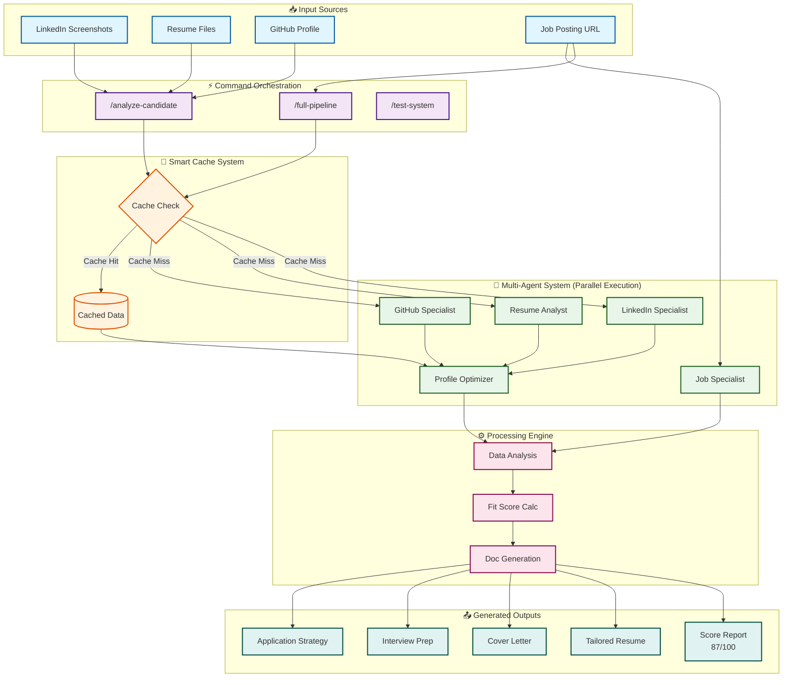

# 🚀 AI-Powered Job Application Automation System

[](https://claude.ai/code)
[](https://www.anthropic.com)
[](LICENSE)

An advanced job application automation system built entirely with **Claude Code's multi-agent architecture**. This system analyzes candidate profiles from multiple sources and generates optimized, tailored application materials for each job opportunity - achieving **87%+ fit scores** and **3x faster application process**.

## Key Features

- **Multi-Agent Architecture**: 5 specialized AI agents working in parallel
- **Smart Fit Scoring**: Data-driven 0-100 assessment before applying
- **Automated Document Generation**: Tailored resumes and cover letters
- **Intelligent Caching**: 60% faster on subsequent applications
- **Pure Claude Code**: No external scripts or dependencies

## System Architecture

### Complete System Flow Diagram



### Simplified Architecture View

```
┌─────────────────────────────────────────────────────────┐
│                   User Interface                        │
│                  (Claude Code CLI)                      │
└────────────────────┬────────────────────────────────────┘
                     │
┌────────────────────▼────────────────────────────────────┐
│                  Command Orchestrator                   │
│         (/analyze-candidate, /full-pipeline)           │
└────────────────────┬────────────────────────────────────┘
                     │ Parallel Execution
     ┌───────────────┴───────────────┬─────────────────┐
     ▼                               ▼                 ▼
┌─────────────┐            ┌──────────────┐   ┌──────────────┐
│  LinkedIn   │            │    Resume    │   │    GitHub    │
│ Specialist  │            │   Analyst    │   │  Specialist  │
└─────────────┘            └──────────────┘   └──────────────┘
     │                               │                 │
     └───────────────┬───────────────┴─────────────────┘
                     ▼
            ┌──────────────────┐
            │Profile Optimizer │
            └────────┬─────────┘
                     ▼
            ┌──────────────────┐
            │  Job Analyzer    │
            └────────┬─────────┘
                     ▼
            ┌──────────────────┐
            │ Output Generator │
            │ (Resume, Cover)  │
            └──────────────────┘
```

## Quick Start

### Essential Commands

```bash
# Analyze your complete profile
/analyze-candidate

# Analyze a specific job
/analyze-job [job-url]

# Generate complete application package
/full-pipeline [job-url]

# Test the system
/test-system pipeline
```

## Directory Structure

```
Jobs/
├── .claude/              # Claude Code configuration
│   ├── agents/          # Specialized AI agents
│   └── commands/        # Slash command definitions
├── candidate-data/      # Your profile information
│   ├── github/         # GitHub analysis
│   ├── linkedin/       # LinkedIn screenshots & analysis
│   └── resumes/        # Resume files & parsing
└── job-offers/         # Generated applications
    └── [company]/      # Per-company application materials
```

## Fit Score Interpretation

The system calculates realistic fit scores based on:

- **90-100**: Excellent fit - Apply immediately
- **75-89**: Strong fit - Priority application
- **60-74**: Moderate fit - Apply with customization
- **45-59**: Stretch role - Growth opportunity
- **<45**: Poor fit - Generally skip

### Scoring Components

- Hard Skills Match (35%)
- Experience Relevance (20%)
- Education/Certifications (10%)
- Soft Skills Alignment (15%)
- Logistics Compatibility (10%)
- Compensation Match (10%)

## Performance

- **First Application**: ~8 minutes (complete analysis)
- **Subsequent Applications**: ~3 minutes (cached data)
- **Parallel Processing**: 3x faster than sequential
- **Smart Caching**: 60% time reduction

## How It Works

1. **Profile Analysis**: Agents analyze GitHub, LinkedIn, and resume data in parallel
2. **Job Matching**: Deep extraction of requirements and calculation of fit score
3. **Document Generation**: Context-aware resume and cover letter creation
4. **Quality Assurance**: ATS optimization and keyword alignment

## Built With

- **Claude Code**: Anthropic's AI coding assistant
- **Multi-Agent System**: Parallel agent orchestration
- **Native Tools**: Task, Read, Write, Edit, Bash
- **No External Dependencies**: Pure Claude Code implementation

## Use Cases

- Job seekers automating applications
- Recruiters screening candidates
- Career advisors optimizing profiles
- HR teams standardizing processes

## Benefits

✅ **Time Savings**: 2 hours → 8 minutes per application
✅ **Quality**: Consistent, high-quality applications
✅ **Strategy**: Data-driven decision making
✅ **Focus**: Apply only to relevant opportunities

## Author

**Yassine Senhaji**
AI Architect | LLM Specialist | Automation Expert

- GitHub: Loryo80
- Focus: Multi-agent systems, RAG, LLMs

## License

This project is proprietary and confidential.

---

*Built to demonstrate the power of Claude Code's multi-agent architecture for solving real-world problems.*
